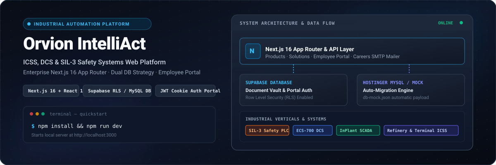
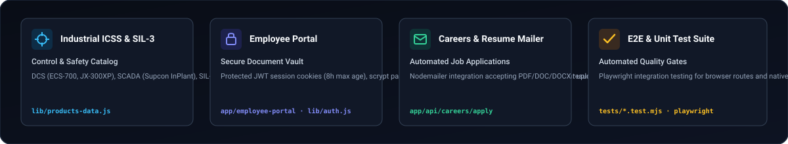
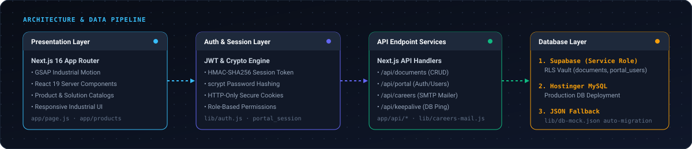

<p align="center">
  
</p>

<p align="center">
  <strong>Full-stack industrial automation web platform &amp; secure employee portal built with Next.js 16 App Router, React 19, GSAP, and dual-layer database persistence.</strong>
</p>

<p align="center">
  <a href="#quick-start">Quick Start</a> •
  <a href="#system-architecture">Architecture</a> •
  <a href="#core-capabilities">Capabilities</a> •
  <a href="#database-strategy">Database &amp; Migration</a> •
  <a href="#employee-portal--security">Security</a> •
  <a href="#deployment">Deployment</a>
</p>

---

## Overview

**Orvion IntelliAct** is an enterprise-grade web application and document management system designed for **Industrial Automation Solutions** across critical sectors including Power, Chemical, Steel & Metals, Refinery, Oil & Gas, Terminal Automation, and Water SCADA.

Built on 25+ years of industrial leadership, the platform showcases SIL-3 rated safety systems, Distributed Control Systems (DCS), Supervisory Control and Data Acquisition (SCADA), and Programmable Logic Controllers (PLCs), while serving internal operations through a role-authenticated Employee Portal and an automated career application pipeline.

---

## Core Capabilities

<p align="center">
  
</p>

- **Industrial ICSS & SIL-3 Catalog**: Dedicated solutions for Control & Safety Systems (ECS-700 DCS, Supcon InPlant SCADA, TCS-900 SIL-3 Safety PLCs, GCS-G3/G5 PLCs, and RTUs).
- **Secure Employee Portal**: Role-based access control for document upload, download, and user management with Row Level Security (RLS).
- **Dual Database Strategy**: Native support for **Supabase PostgreSQL** with RLS policies, alongside **Hostinger MySQL** with automatic JSON fallback migration.
- **Automated Resume & Careers Pipeline**: Nodemailer SMTP integration handling multi-part candidate submissions with PDF, DOC, and DOCX document validation.
- **GSAP-Powered Motion UI**: Smooth visual transitions tailored for technical audiences without sacrificing performance.
- **Automated Testing Suite**: E2E browser testing with Playwright and unit test verification via Node.js native test runner.

---

## System Architecture

<p align="center">
  
</p>

The platform follows a layered Next.js 16 App Router architecture:

1. **Presentation Layer**: Next.js 16 React Server Components with GSAP animations for products, solutions, company pages, and portal dashboards.
2. **Auth & Session Middleware**: Custom JWT session signing (`HMAC-SHA256`), `scrypt` password hashing, and HTTP-only cookie enforcement (`portal_session`).
3. **API Services Layer**: API routes (`/api/documents`, `/api/portal`, `/api/careers`, `/api/contact`, `/api/keepalive`) managing multi-part files and database transactions.
4. **Data Persistence**: Primary Supabase client via service-role key or Hostinger MySQL pool with `lib/db-mock.json` schema seeding.

---

## Quick Start

### Prerequisites

- **Node.js**: v18.0.0 or higher
- **npm** or **pnpm**

### Installation & Local Run

1. **Clone the repository**:
   ```bash
   git clone https://github.com/Orvion-IntelliAct.git
   cd Orvion-IntelliAct
   ```

2. **Install dependencies**:
   ```bash
   npm install
   ```

3. **Set up Environment Variables**:
   Copy the example environment configuration:
   ```bash
   cp .env.example .env.local
   ```

4. **Launch the Development Server**:
   ```bash
   npm run dev
   ```
   Open [http://localhost:3000](http://localhost:3000) in your browser.

---

## Database Strategy & Migration

Orvion IntelliAct provides dual database drivers in `lib/db.js`:

### 1. Supabase Vault (Recommended)
When `NEXT_PUBLIC_SUPABASE_URL` and `SUPABASE_SERVICE_ROLE_KEY` are provided:
- Queries execute against Supabase PostgreSQL using server-side `service_role` credentials.
- Tables `documents` and `portal_users` are protected by Row Level Security (RLS).
- Execute SQL migrations located in `supabase/migrations/`:
  - `20260713132532_create_documents_table.sql`
  - `20260723000000_enable_rls_on_documents.sql`
  - `20260723070558_create_portal_users.sql`

### 2. Hostinger MySQL Auto-Migration Fallback
When deploying to traditional MySQL hosting (Hostinger):
- Set `DB_HOST`, `DB_PORT`, `DB_USER`, `DB_PASSWORD`, and `DB_NAME`.
- The application detects empty tables upon first boot and automatically seeds data from `lib/db-mock.json`.

---

## Employee Portal & Security

The Employee Portal (`app/employee-portal`) enforces strict security standards:

- **Password Storage**: Passwords are hashed using `crypto.scryptSync` with random 16-byte salts (`salt:hash`).
- **Session Tokens**: Signed non-encrypted JWT tokens carrying user state and explicit expiration (`PORTAL_SESSION_SECRET`).
- **HTTP-Only Cookies**: Tokens are passed via `portal_session` with `httpOnly: true`, `secure: true`, `sameSite: "lax"`, and an 8-hour maximum age.
- **Access Control**: RLS policies restrict direct database access to server-side routes only.

---

## Careers SMTP Mailer

The careers page (`/api/careers/apply`) allows candidates to submit job applications directly:

- Validates file MIME types and extensions (`.pdf`, `.doc`, `.docx`).
- Streams resume attachments directly into SMTP payloads via `nodemailer`.
- Requires `SMTP_HOST`, `SMTP_PORT`, `SMTP_USER`, `SMTP_PASSWORD`, `MAIL_FROM`, and `CAREERS_TO_EMAIL`.

Run careers mailer tests:
```bash
npm run test
```

---

## Deployment

The application includes step-by-step production guides in [`deployment_guide.md`](./deployment_guide.md):

1. **Hostinger Node.js App Setup**:
   - Build locally: `npm run build`
   - Package files (excluding `node_modules`) and extract inside `public_html`.
   - Configure Node.js Application Startup File to `server.js`.
2. **GoDaddy DNS Configuration**:
   - Point domain `A Record` to Hostinger shared server IP.
   - Configure `CNAME` for `www` host routing.

---

## Testing & Quality Assurance

- **Unit & Integration Tests**:
  ```bash
  npm run test
  ```
- **Playwright End-to-End Suite**:
  ```bash
  npx playwright test
  ```

---

## Repository Structure

```text
Orvion-IntelliAct/
├── app/                      # Next.js 16 App Router pages & API handlers
│   ├── api/                  # API endpoints (documents, portal, careers, contact)
│   ├── company/              # Company profile & history pages
│   ├── employee-portal/      # Role-based employee authentication portal
│   ├── products/             # Control & Safety, DCS, SCADA, PLC product pages
│   ├── solutions/            # Industrial vertical solutions (Refinery, Power, Steel)
│   └── layout.js             # Root layout with navigation & footer
├── components/               # UI components and interactive elements
├── lib/                      # Business logic, auth, db drivers, and site data
│   ├── auth.js               # Crypto scrypt hashing & JWT session management
│   ├── db.js                 # Dual Supabase / Hostinger MySQL database adapter
│   ├── careers-mail.js       # Resume validation & Nodemailer SMTP handler
│   └── products-data.js      # Industrial systems catalog metadata
├── supabase/                 # Database migrations and Supabase configuration
│   └── migrations/           # SQL migration files for RLS & tables
├── tests/                    # Unit tests (Node.js test runner)
├── deployment_guide.md       # Production Hostinger & GoDaddy deployment guide
└── package.json              # Project dependencies & npm scripts
```

---

<p align="center">
  <sub>Orvion IntelliAct Automation — Industrial Automation &amp; Engineering Excellence</sub>
</p>
