# Page 1

COMPANY PROFILE

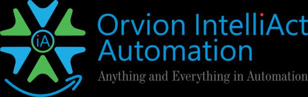

# Page 2

Orvion IntelliAct Automation Pvt Ltd was founded by two senior executives from a
leading multinational industrial automation company, bringing over 25 years of
global experience.

With a proven track record of delivering large and complex automation projects
worldwide, Orvion combines deep domain expertise with Technical Excellence to
provide Innovative and Reliable Solutions.

OIAPL specialises in Industrial Automation across key sectors such as Power,
Chemicals, Steel, Metals, Refineries & Oil & Gas, Terminal Automation, Water
SCADA, and more…

About OIAPL

# Page 3

To become the most trusted provider of
automation solutions by delivering
cutting-edge technology, innovation,
exceptional service, safety, and superior
quality in a highly competitive manner.

We strive to create value for our
customers and make a meaningful
difference.

We are dedicated to building lasting
relationships by upholding
professionalism and transparency in all
aspects of our business

To become the leading one-stop
solutions provider, revolutionizing the

automation industry with innovative,
reliable, and comprehensive solutions

and services.

Orvion IntelliAct  aspires to lead the

industrial automation sector by
embracing the latest technologies to

deliver sustainable and

intelligent solutions.

Our MISSION

Our VISION

# Page 4

Why OIAPL?

Comprehensive Solutions

End-to-end automation services
that address all facets of
industrial operations

Innovative Technology

We leverage cutting-edge
technology to enhance
efficiency and
competitiveness

Industry Expertise

Our experienced team provides
tailored solutions to meet
unique operational challenges

Commitment to Excellence

Quality and precision are central
to everything we do, ensuring
adherence to industry standards

Timely Delivery

Timely Delivery is reason for
success in any Organization,
we are committed to this aspect.

Customer First

“A satisfied customer is the
best business strategy of  all.”
we believe in it.

# Page 5

Our Trusted Partners

Transform the process industry with AI-driven automation,
empowering businesses in Chemicals, Energy & Materials.
The Next Level of Fire and

Life Safety Leadership

Specialists in Control Panels,
Switchgear and Power Distribution

Solutions

Turning technology into

“Technology for Life”

# Page 6

Meet the Directors

Ex-Director – Program Management | Honeywell Automation (I) Ltd.
A seasoned industry leader with 29+ years of overall experience,
including 22 years with Honeywell, and over 5 years heading
Honeywell India operations.

Led Honeywell’s Project & Automation Solutions Business across all
verticals in India, with end-to-end responsibility spanning:
• Strategic Sales & Business Development
• Project Management & Execution
• Automation Solutions Delivery
• Final Handover & Customer Satisfaction

Successfully delivered highly complex and large-scale projects
across multiple industry verticals, with a strong blend of
Global and Domestic project experience.

Recognized for
• Strong industry connect and professional reputation
• Hands-on leadership approach
• Driving operational excellence and customer value
• Managing challenging, multi-disciplinary programs

Education & Certifications
MBA
B.E. (Electrical Engineering) – Pune University
Six Sigma Green Belt Certified

Sachin Samant
Founder & CEO

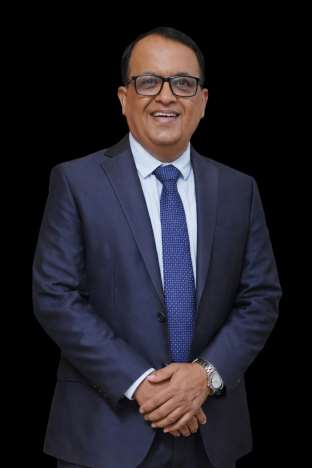

Ex-Operations Head | Honeywell Automation (I) Ltd.
A seasoned operations leader with 24+ years of overall experience,

including 20 years with Honeywell, and over 5 years leading
Honeywell’s Terminal Automation & Pipeline Business in India.

Held full lifecycle responsibility from Sales and Business Development

to Project Execution and Final Handover, ensuring operational

excellence and customer satisfaction.

Successfully delivered highly complex and large-scale projects,

including all four phases of Hazira Port, demonstrating strong

execution capability across critical infrastructure projects.

Brings a strong mix of Global and Domestic project

experience, backed by a solid industry network

and respected professional reputation.

Education & Certifications

MBA
B. Tech – Electrical & Electronics Engineering,

(JNU Technological University, Hyderabad)

PMP® Certified
Six Sigma Green Belt Certified

Sreedharan P.

Director

# Page 7

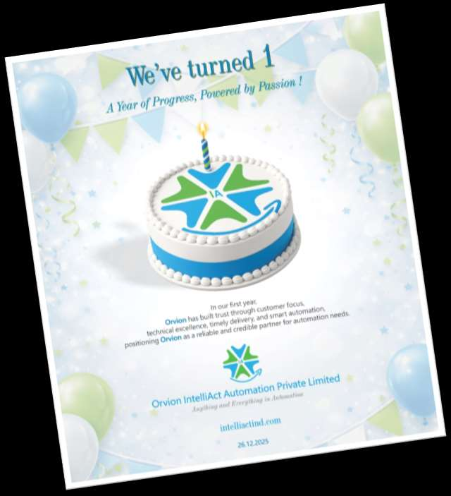

Infrastructure & Team – OIAPL

Team Strength
Built and developed a dedicated team of 10 professionals, including
9 technically qualified members, ensuring strong domain expertise
and execution capability.

Infrastructure
A fully equipped 1,000 sq. ft. office in Pune, designed to support
project management, engineering coordination, and client
interactions.

Client Engagement
The office regularly hosted customers for project discussions,
review meetings, and technical deliberations, strengthening
professional relationships and trust

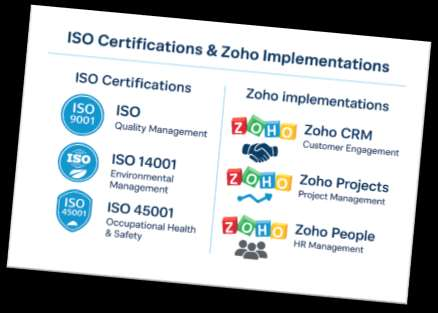

# Page 8

Industry recognition

Represented the organization at the CEO Conclave during the
IEC Annual Event, Mumbai – November 2025.

Shared the dais with distinguished industry leaders, including:
CEO, Yokogawa / CEO, Adage Automation /
CEO, Samson Controls Pvt. Ltd. / CEO, SUPCON Technology Co. Ltd.

This participation reflects strong industry presence, leadership
credibility, and recognition among global automation and control
system leader

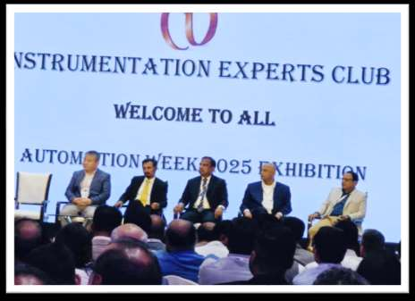

“In today’s industrial landscape, Automation is the
engine of productivity, the guardian of safety, and the
architect of future-ready enterprises.”

# Page 9

Our esteemed Clientele

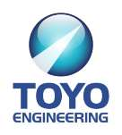

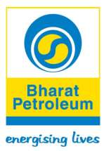

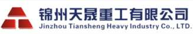

# Page 10

26th Dec 2024
19th Mar 2025
1st Apr 2025
18th Apr 2025
16th May 2025
5th July 2025
7th July 2025
2nd Sep 2025

OIAPL inception
1st Order
Office
Operational at

Pune

ISO 9001,
14001 & 45001

Certification

2nd Order
3rd Order
4th Order
5th Order

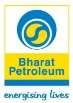

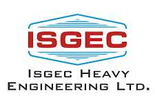

Our 1st Year Journey and achievements

# Page 11

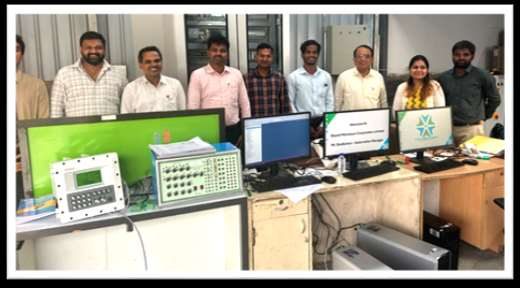

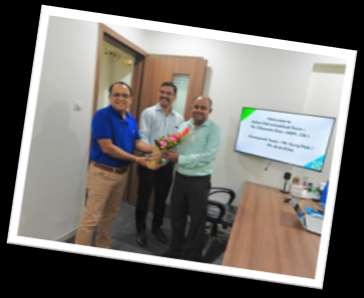

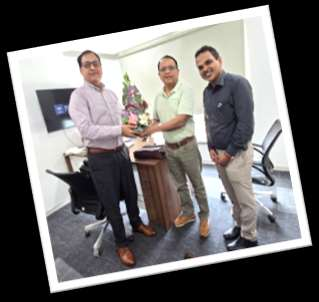

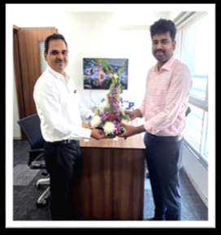

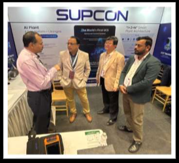

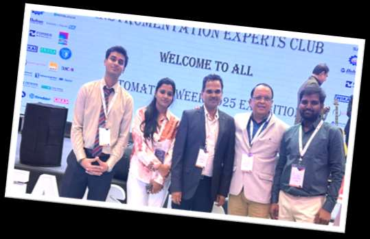

Customer Engagements and Reach out
through Events

# Page 12

Power Plant
Automation

We specializes in power
plant Automation, ensuring
reliable, efficient, and
sustainable power
generation and
distribution.

Our solutions cover Main
Automation of Power Plant,
Load Management.
Expertise in R&M / Projects

Terminal
Automation

We deliver end-to-end
solutions in Pipeline
SCADA, PIDS, Terminal
automation to enhance
control, security, and
efficiency in fuel handling,
storage, tank truck systems,
and wagon loading.

Our systems streamline
operations, minimize
errors, and reduce
downtime.

Refinery
Automation

Our Refinery Automation
solutions address process
Optimization, Safety and
Regulatory compliance.

It covers Process Control,
Monitoring and Predictive
Maintenance to enhance
performance in refinery
operations.

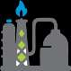

Metals / Mining
Automation

Our customised solutions
for the Metals and Mining
Sectors optimize processes
from Extraction to Refining.

It improves Productivity,
Safety, and Environmental
Impact.

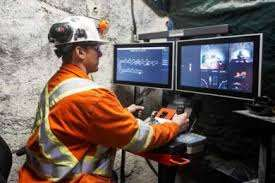

Water
SCADA

We provide comprehensive
Automation for Water
distribution and treatment
systems.

We manage Real-time
Data, Fault detection, and
Control to help clients
optimize water usage and
ensure regulatory
compliance.

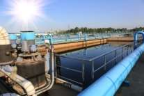

Wide range of Solutions for an Effective Market Reach

Our Solutions - Core Business Model

# Page 13

Chemical
Automation

We specializes to the
application of automated
systems and AI in Chemical
processes, Research, and
manufacturing.

It aims to enhance
efficiency, precision, and
safety while reducing
human intervention in
repetitive or hazardous
tasks

Pharma & Paper
Automation

We Strive Automation in
Pharmaceutical & Paper
industry to streamline
processes, enhance
efficiency.

We also ensure accuracy,
and maintain compliance
with regulatory standards.

Engineering
Services

Expert solution on
Engineering (Design,
Detailed, Hardware,
Software), Project Execution.

Also on Site Implementation,
AMC & Manpower provision
on field like Safety, Security,
Reliability and Sustainability
side across all Process &
Automation Industries.

Software
Services

Manpower
Services

We offers a workforce of
highly skilled, certified
professionals in
automation, control
systems, and maintenance,
ensuring clients have the
right resources to operate
and maintain their
automated systems.

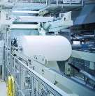

We are into Industrial
Software & Mobility
Applications like Cyber,
Industry 4.0, IIoT and AI
initiatives to analyzes the
Asset Data.

Convert it into actionable
intelligence for Ops,
Engineering, Maintenance,
Analytic Applications / IT
Enterprise to enhance the
outcomes across industries.

Detail Engg.
Consultancy

We outline Clearly the
boundaries of the
consultancy work. Defining
deliverables, timelines, and
key performance indicators
(KPIs). Identifying roles and
responsibilities for both the
consultant and the client.

Special Focus towards Cost Optimization using Cutting-edge Technology

Our Solutions - Core Business Model

# Page 14

Our Core Values

Industry
Expertise

• Knowledgeable about a wide range of industries,
industry-specific insights, feel free to provide solutions

• Tailor made Solutions of every aspects

Technology

• Application of Latest knowledge, tools.
• Usage of and methods to solve problems, create systems, and improve human life
• Innovations for generating, storing, and consuming energy
• Technologies aimed at sustainability

Quality

• Timely Delivery of products / projects / solutions
• Timely supports to all service calls
• Delivery with quality and value engineering

Customer Centric

Approach

• Strong Relationship and good connect with customer
• Direct connect with OEM
• Partnered with Global Brand for variety of Products and solutions
• Partnered with Local Brand for Economy Growth and localizations

# Page 15

Our Solution offerings

PROCESS  OPTIMISATION

AAIMS / PHD / Historian
/ Asset Management / RTDBMS
/ Loop Optimization / Intelligent Devices Management /

Personnel Positioning System

SOFTWARE / CLOUD

Industrial Operating System
AI / Cyber / Industry 4.O / Robotic

/ Equipment Remote Diagnostic

/ IIoT Access / Public Cloud

/ On-Premise / SaaS

MACHINE MONITORING &

COMPRESSOR CONTROL

Vibration Monitoring System
Generator, Turbine, Rotating Machine, Pumps

/ Sensor / Corrosion and Leakage monitoring

Compressor Control System

Interlock Protection
/ Anti-surge Control / Speed Adjustment

Performance Control

WATER / ELECTRICAL
Water : Smart Solutions / SCADA / Distribution /

Irrigation,  Sewage Treatment Plant, ETP

Electrical : HT LT Switch Gear / MCC / PMCC Panel,

VFD Panel, Breaker Panel / Capacitor Panel

/ GAS Insulated Switch Gear / DOL Starter

REFINERY & PIPELINES

DCS / Safety PLC/ SCADA / PLC / RTU / Cyber Security
F & G / CCTV / Fire Alarm/ Access Control  / Gas Detection

Process & Field Instruments / Monitoring  Solutions
Pipeline SCADA / Telecom / Leak Detection / Batch Tracking

TERMINAL AUTOMATION

TAS / Tank Farm Management / Metering Equipment
Software : ERP /Order/ Customer / Dealer Management
Blending / Additive Dosing / Vehicle Tracking system
Skid : Loading / Unloading / Overspill / Earthing Relay

POWER PLANT AUTOMATION

Boiler Automation /Turbine Control Systems / Coal and Ash
Handling Automation / Water Treatment and Steam Cycle
Management / Renovation and Modernisation (R & M)

CHEMICAL / PHARMA

Control System / Remote IO / L2 Integration / Field Instruments
/ Valves / Flow Meter / Product Lifecycle Management (PLM) /
Regulatory Compliance/ Digital Logbook /Data analytics /
Reports / Dashboard /Batch Management

# Page 16

Our Product offerings

in AUTOMATION

ANALYSER

• Flare Gas Measurement
• Blast Furnace Gas and Coke Oven Gas
• Air / Fuel Ratio Control

CONTROL SYSTEM

• SCADA / DCS / PLC
• RTU / Safety PLC
• Universal Control System
• Isolator / Barrier
• Safety Relay / SPD
• HART Communicator

FIELD INSTRUMENTS

• PT / TT / DPT / PG
• Process Controller / Calibrator
• Recorder /Control Valves
• Smart Valve Positioner

F&G AND SECURITY

• Fire & Gas Detector
• Fire Alarm Panel
• CCTV System
• Access Control System
• Network Management System

FLOW & LEVEL INSTRUMENTS

• Radar / Guided Wave Radar
• Fork / Flap type Level Switch
• Float type Level Guage
• Vortex / Turbine Flow Meter
• Smart Metal Tube Rotameter
• Electromagnetic Flowmeter

SWITCHES WIRELESS PRODUCTS
• Coupler / Industrial Switch / POE Switch / Smart EIO
• Wireless Gateway
• Wireless Transmitter

SOFTWARE

• IIoT / Cyber / Industry 4.0
• Digital Twin
• Laboratory Information
Management (LIMS)

# Page 17

Our Electrical Product offerings

VCB BREAKER PANEL

UPTO 33KV

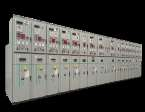

VACUUM
CONTACTOR
PANEL

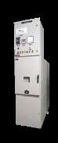

33KV, KIOSK FOR
WIND & SOLAR

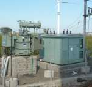

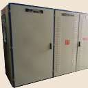

UNITIZED PACKAGE
SUB-STATION (33 KV)

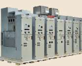

GAS INSULATED
SWITCH GEAR (GIS)

CAPACITOR
PANEL
UPTO 36 KV

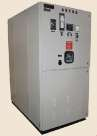

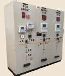

C&R PANEL FOR
ELECTRICITY BOARD

Electrical Power, Control &
Automation Experts

• End-to-end integrated solutions provider
• Advanced manufacturing with
cutting-edge technology
• IEC-compliant, NABL lab type-tested
(ERDA, CPRI, ASTA)
• Design & manufacture of LV &
MV Switchgears
• Driven by innovation, R&D and
uncompromising quality standards

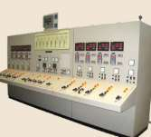

ELECTRICAL
CONTROL DESK

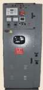

MEDIUM
VOLTAGE
DOL STARTER

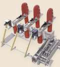

ON LOAD ISOLATOR
(LBS) 400A

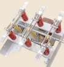

OFF LOAD
ISOLATOR
3150A

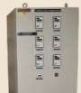

TEMPERATURE
SCANNER
PANEL

SWITCH FUSE
UNIT (SFU)

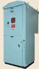

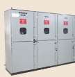

RING MAIN UNIT
[RMU]

# Page 18

Our TOP CUSTOMER CONNECT

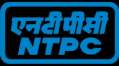

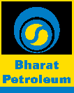

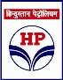

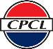

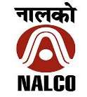

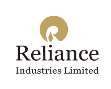

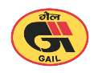

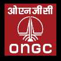

Our EPC CONNECT

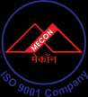

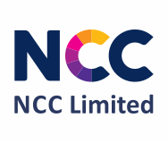

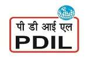

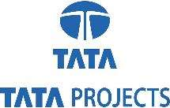

# Page 19

HEAD OFFICE :
PUNE MAHARASHTRA, INDIA

BRANCH OFFICE :
CHENNAI , INDIA

SHARED FACTORY :
Two manufacturing facilities with a
Total built-up area of over 1,13,000  Sq. ft.
Our specialization

• Industrial Automation Solutions
• Manufacturing & Assembly Control System
• Turnkey Automation Projects
• Deployment of Industrial Software Solutions

Contact :
+91 98902 00799
+91 99705 92052
email: info@IntelliActind.com

